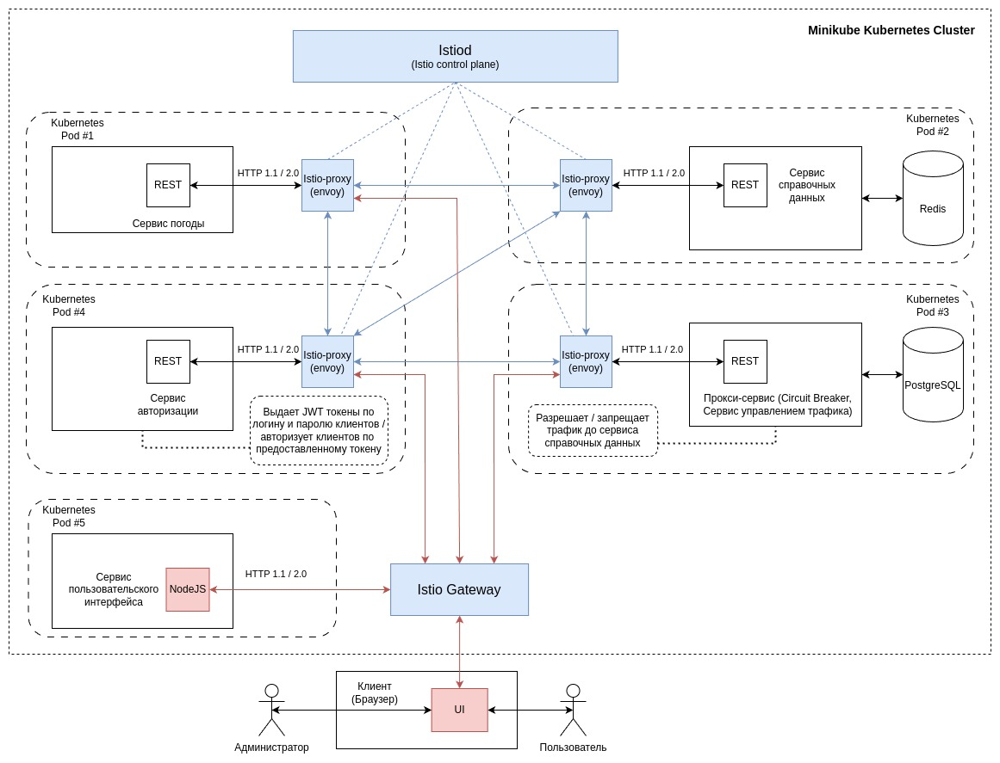

<h2> Docker build & push </h2>

> bash docker-build.sh
> 
> bash docker-push.sh

<h2> App installation </h2>

> minikube start --cpus 8 --memory 8192
> 
<i>loadbalancer necessary for istio ingress gateway, execute in separate terminal</i>
> minikube tunnel
>
<i>applying app manifests</i>
> bash kube-apply.sh

<h2> Istio installation </h2>

> cd istio-1.21.0
> 
> export PATH=$PWD/bin:$PATH
> 
<i>and finally (needs restart of all pods for istio-proxy injection)</i>
> bash istio-apply.sh
> 
<i>Do not forget to specify Istio Ingress IP address in weather-mesh-ui/deployment.yaml and rerun kube-apply.sh</i>
- env:
- - name: REACT_APP_GATEWAY_IP
- - value: < IP > (default is 10.96.145.27)